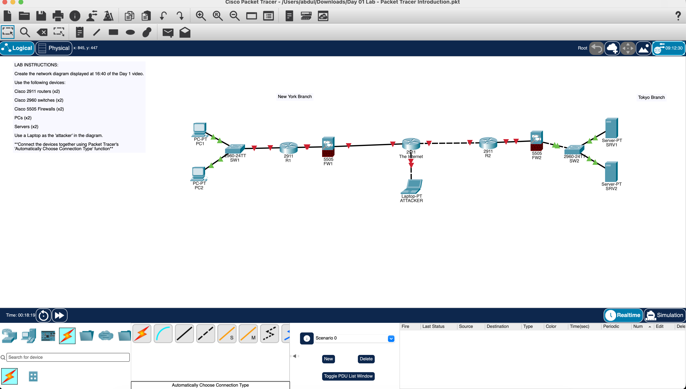

# Day 01 — Packet Tracer Introduction

[Back to portfolio](../README.md)

**Course:** Jeremy's IT Lab  
**Topic:** Network devices and topology construction  
**Tool:** Cisco Packet Tracer  
**Status:** Topology-building exercise complete; screenshot documented; completed `.pkt` file pending.

## Lab Overview

I recreated a two-branch network topology in Packet Tracer, with New York and Tokyo branch labels, a central router representing the Internet, and a laptop labeled ATTACKER. This introductory exercise focused on navigating the workspace, selecting devices, arranging the topology, and connecting devices using automatic connection selection.

The screenshot documents the completed layout. It does not establish a fully configured or operational routed network.

## Network Topology



The connections visible in the submitted screenshot are:

```text
PC1 ─┐
     SW1 ─ R1 ─ FW1 ─ The Internet ─ R2 ─ FW2 ─ SW2 ─┬─ SRV1
PC2 ─┘                    │                         └─ SRV2
                       ATTACKER
```

The left side is labeled **New York Branch** and the right side **Tokyo Branch**. The diagram above records the actual screenshot layout, including the order of R1/FW1 and R2/FW2. The Internet device is a simulated router, and ATTACKER is a scenario label; no attack or security test is demonstrated.

## Objectives

- Become familiar with the logical workspace and device selection tools.
- Place the required routers, switches, firewalls, and endpoints.
- Label the devices and branch locations clearly.
- Connect the devices using **Automatically Choose Connection Type**.
- Preserve the finished topology as evidence of the exercise.

## Devices Used

| Device type | Model shown | Quantity | Labels |
| --- | --- | --- | --- |
| Branch router | Cisco 2911 | 2 | R1, R2 |
| Internet-representing router | Cisco 2911 | 1 | The Internet |
| Switch | Cisco 2960-24TT | 2 | SW1, SW2 |
| Firewall | Cisco 5505 | 2 | FW1, FW2 |
| PC | PC-PT | 2 | PC1, PC2 |
| Server | Server-PT | 2 | SRV1, SRV2 |
| Laptop | Laptop-PT | 1 | ATTACKER |

**Total: 12 devices**, including three routers overall.

## Tasks Completed

1. Placed the network devices and endpoints in the logical workspace.
2. Arranged them into the two-branch layout with a central Internet router.
3. Applied the visible device names and branch labels.
4. Connected the devices using Packet Tracer's automatic connection selection.
5. Captured the completed topology for the portfolio.

## Skills Practiced

- Packet Tracer navigation and device placement.
- Identification of common network devices and endpoint types.
- Clear device naming and topology organization.
- Physical connection creation within the logical workspace.
- Evidence-based lab documentation.

## Verification and Observations

| Check | Evidence and result |
| --- | --- |
| Device inventory | Screenshot shows the 12 devices listed above. |
| Names and layout | Device names and both branch labels are visible. |
| Connections present | Screenshot shows cables between the devices in the documented layout. |
| Interface state | Green indicators appear on endpoint-to-switch links; several router/firewall-facing links have red indicators. |
| IP addressing and routing | No addressing table, configuration output, or routing verification was supplied. |
| End-to-end connectivity | No ping or other traffic test was supplied; connectivity is unverified. |

The red indicators show that several links are down in the captured state. Their specific causes have not been diagnosed. This Day 1 exercise demonstrates topology construction; interface configuration and connectivity testing remain outside the documented results. No Cisco IOS commands or troubleshooting fixes are claimed for this exercise.

## Evidence

### Completed network topology

**File:** [01-completed-network-topology.png](../Photos/Day-01/01-completed-network-topology.png)

This is the original screenshot of my Packet Tracer workspace. The lesson/video screenshot is reference material and is excluded from the evidence folder.

### Packet Tracer file

**Pending:** `day-01-packet-tracer-introduction.pkt`.

The completed saved file will be added as `Labs/day-01-packet-tracer-introduction.pkt` when supplied. Once available, download it and open it in Cisco Packet Tracer to inspect the topology.

## What I Learned

- A topology makes device relationships easier to follow when endpoints and branch locations are labeled clearly.
- Packet Tracer's automatic connection tool helps with initial cabling practice.
- Placing and connecting devices is only the first stage of building a network. Interface state, addressing, routing, and traffic tests need their own verification.
- A useful lab record distinguishes what is visible in a screenshot from what still needs to be tested.

## Reference

Jeremy's IT Lab — Day 1, Packet Tracer Introduction. The course supplied the exercise; the screenshot records my completed topology-building work.
