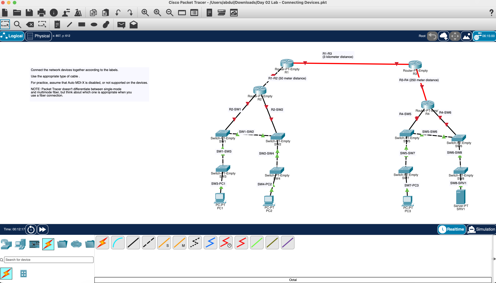

# Day 02 — Connecting Network Devices

[Back to portfolio](../README.md)

**Topic:** Ethernet cabling and distance-based media selection  
**Tool:** Cisco Packet Tracer  
**Status:** Cabling topology documented; interface and connectivity verification pending.

## Overview

This exercise connects four routers, eight switches, three PCs, and one server according to the topology labels. The focus is selecting cables for different device pairs and considering the distance between routers.

The exercise assumes Auto MDI-X is disabled or unsupported, so straight-through and crossover cable choices matter.

## Network Topology

R1 connects to R2 over a labeled 50-meter link and to R3 over a labeled 3-kilometer link. R3 connects to R4 over a labeled 250-meter link. R2 serves the left switch network; R4 serves the right switch network.

## Objectives

- Connect each labeled device pair.
- Distinguish straight-through and crossover Ethernet connections.
- Consider fiber for distances beyond a typical copper Ethernet channel.
- Recognize that cable placement and operational connectivity require separate checks.

## Devices Used

| Device | Model shown | Quantity | Labels |
| --- | --- | --- | --- |
| Router | Router-PT-Empty | 4 | R1–R4 |
| Switch | Switch-PT-Empty | 8 | SW1–SW8 |
| PC | PC-PT | 3 | PC1–PC3 |
| Server | Server-PT | 1 | SRV1 |

**Total:** 16 devices and 17 visible connections.

## Cable Selection

The following table records the intended cable choices for this exercise. Exact port and module selections require inspection of the saved Packet Tracer file.

| Connection | Intended cable | Reason |
| --- | --- | --- |
| R1–R2 (50 m) | Copper crossover | Router-to-router Ethernet with Auto MDI-X unavailable; within the usual 100 m copper channel limit. |
| R1–R3 (3 km) | Fiber; single-mode for this exercise | A long-distance link that exceeds copper Ethernet reach. |
| R3–R4 (250 m) | Fiber; multimode with suitable optics for this exercise | Beyond the usual copper channel limit; supported fiber reach depends on optics, speed, and fiber grade. |
| R2–SW1, R2–SW2 | Copper straight-through | Router-to-switch Ethernet. |
| R4–SW5, R4–SW6 | Copper straight-through | Router-to-switch Ethernet. |
| SW1–SW2, SW1–SW3, SW2–SW4 | Copper crossover | Switch-to-switch Ethernet with Auto MDI-X unavailable. |
| SW5–SW6, SW5–SW7, SW6–SW8 | Copper crossover | Switch-to-switch Ethernet with Auto MDI-X unavailable. |
| SW3–PC1, SW4–PC2, SW7–PC3 | Copper straight-through | Switch-to-PC Ethernet. |
| SW8–SRV1 | Copper straight-through | Switch-to-server Ethernet. |

Packet Tracer does not distinguish single-mode and multimode fiber in this exercise. Those distinctions are design choices, not properties verified from the screenshot.

## Work Completed

1. Connected the labeled router pairs.
2. Connected R2 and R4 to their respective switches.
3. Added the switch-to-switch links on both sides.
4. Connected PC1, PC2, PC3, and SRV1 to their access switches.
5. Captured the resulting topology with the connection and distance labels visible.

## Verification and Observations

| Check | Observation |
| --- | --- |
| Topology inventory | All 16 devices and 17 labeled connections are visible. |
| Copper link appearance | Dashed links appear between like device types; solid black links appear on router-to-switch and switch-to-endpoint connections. |
| Long-distance links | R1–R3 and R3–R4 appear as red lines; cable properties and modules still need confirmation in the saved file. |
| Switch and endpoint links | Green indicators are visible on switch-to-switch and switch-to-endpoint links. |
| Router-facing links | Red indicators remain visible. Their cause has not been diagnosed. |
| Connectivity testing | No IP addressing, routing output, or ping results are included in the evidence. |

The screenshot supports completion of the connection layout. It does not establish successful end-to-end communication or independently verify every cable and interface property.

## Skills Practiced

- Reading topology and distance labels.
- Selecting Ethernet cables under the no-Auto-MDI-X assumption.
- Comparing copper and fiber requirements.
- Connecting routers, switches, and endpoints.
- Separating physical link observations from traffic verification.

## What I Learned

- Cable selection depends on the device pair when automatic crossover is unavailable.
- Link distance influences the choice between copper and fiber.
- Fiber selection also depends on compatible interfaces and their supported reach.
- A connected diagram is a starting point; interface state and traffic tests determine whether the network operates.

## Evidence

- **Screenshot:** [01-completed-network-topology.png](../Photos/Day-02/01-completed-network-topology.png)
- **Packet Tracer file:** `Labs/day-02-connecting-devices.pkt` — pending the completed saved file.
