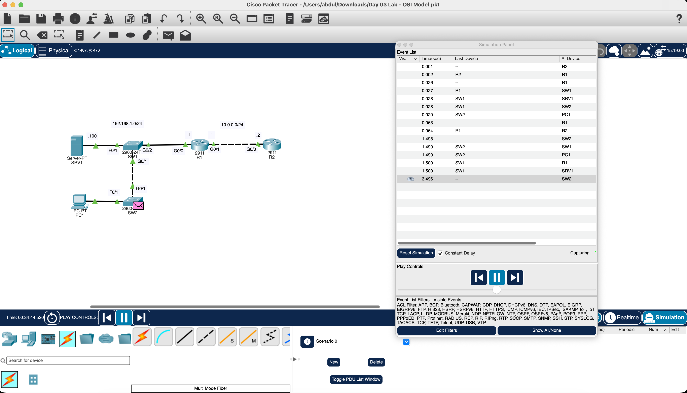
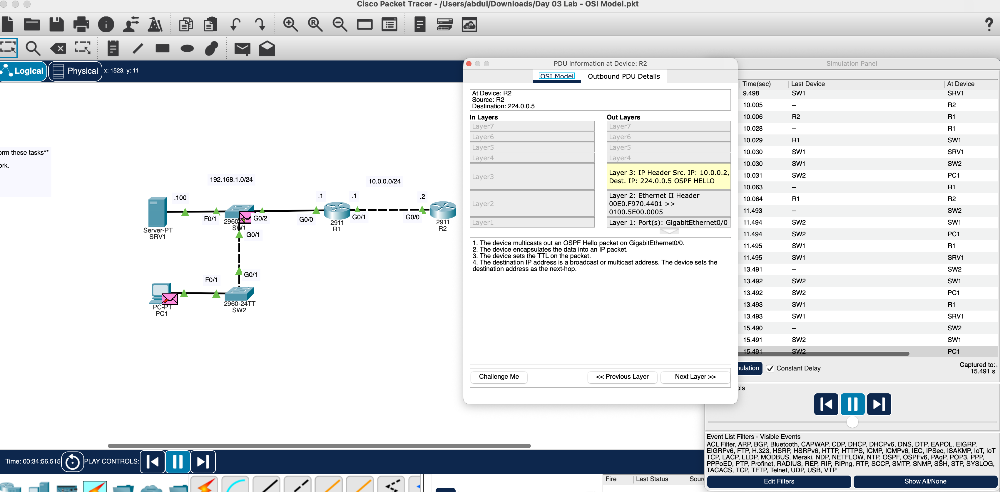
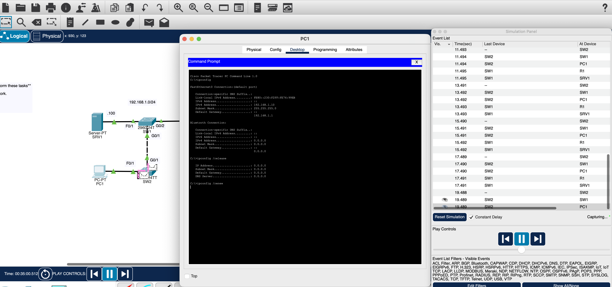

# Day 03 — OSI Model & DHCP Packet Analysis

[Back to portfolio](../README.md)

**Topic:** Simulation mode, OSI layers, and DHCP  
**Tool:** Cisco Packet Tracer  
**Status:** Exercise completed; simulation, OSPF PDU, and PC1 release/renew command screenshots saved. Completed DHCP renewal, detailed DHCP packets, and saved `.pkt` file pending.

## Overview

I used the supplied network to study traffic in Simulation mode and relate packet processing to the OSI model. The second task was to release and renew PC1's IP address to generate DHCP traffic for analysis.

## Network Topology



```text
SRV1 ─ SW1 ─ R1 ─ R2
        │
       SW2 ─ PC1
```

## Objectives

- Observe traffic moving through the network in Simulation mode.
- Relate protocol behavior to the OSI layers involved.
- Release and renew PC1's IP address to generate application-layer traffic.
- Understand how DHCP data is carried inside UDP, IPv4, and Ethernet.

## Devices and Addressing

| Device | Model | Role / addressing label |
| --- | --- | --- |
| PC1 | PC-PT | Client; 192.168.1.10/24 before release, gateway 192.168.1.1 |
| SRV1 | Server-PT | Server; 192.168.1.100 |
| SW1, SW2 | Cisco 2960-24TT | Local Ethernet switching |
| R1 | Cisco 2911 | G0/0: 192.168.1.1; G0/1: 10.0.0.1 |
| R2 | Cisco 2911 | G0/0: 10.0.0.2 |

Router and server addresses above are read from the topology labels. PC1’s initial settings are confirmed by its `ipconfig` output; R2’s source address is also visible in the OSPF PDU. The LAN is labeled `192.168.1.0/24`; the router-to-router network is labeled `10.0.0.0/24`.

## Tasks Completed

1. Opened the lab in Simulation mode.
2. Ran the simulation and followed events between the devices.
3. Completed the PC1 release/renew task and traffic-analysis exercise.
4. Captured the network and Simulation event list.

The additional command screenshot confirms that PC1 displayed its settings, released its address, and issued `ipconfig /renew`. It stops before renewal results are displayed.

## OSI Layer Analysis

| Layer | Role in this exercise |
| --- | --- |
| 7 — Application | DHCP requests and supplies host configuration. |
| 6 — Presentation | A conceptual layer for data representation; no separate presentation-layer protocol is demonstrated here. |
| 5 — Session | A conceptual layer for managing sessions; no separate session-layer protocol is demonstrated here. |
| 4 — Transport | UDP carries DHCP messages between client and server ports. |
| 3 — Network | IPv4 provides source and destination IP addressing. |
| 2 — Data Link | Ethernet uses MAC addresses and frames on the local network. STP is also a Layer 2 control protocol. |
| 1 — Physical | The links carry the bits between connected interfaces. |

**Answer to the lab question:** the layers depend on the selected event. STP is Layer 2 control traffic carried over physical links. DHCP is an application-layer protocol whose messages use Layers 4, 3, 2, and 1 for delivery. A single event does not need a separate protocol at every OSI layer.

The screenshot's Type column is off-screen, so the pink envelope is not used by itself as proof of a particular protocol.

## PC1 Release and Renew

To repeat the exercise, open **PC1 → Desktop → Command Prompt** and run:

```text
ipconfig /release
ipconfig /renew
ipconfig
```

The first command releases the lease; the second requests configuration again. The final command displays the resulting settings. The screenshot shows an initial `ipconfig`, followed by `ipconfig /release` and `ipconfig /renew`. The final verification command above is the next check after renewal finishes.

### DHCP exchange to inspect

For a fresh lease, the usual sequence is **Discover → Offer → Request → Acknowledgment (DORA)**. DHCP uses UDP port **68** at the client and **67** at the server. An initial Discover from a client without an address normally uses IPv4 source `0.0.0.0` and destination `255.255.255.255`; its Ethernet destination is the broadcast MAC address. Renewing an existing lease can use a shorter exchange. These are expected protocol behaviors, not fields verified in the attached screenshot. [DHCP specification, RFC 2131](https://www.rfc-editor.org/rfc/rfc2131)

Select a DHCP event and inspect its **OSI Model** and **PDU Details** to compare the application message, UDP ports, IP addresses, and Ethernet addresses.

```text
DHCP message → UDP datagram → IPv4 packet → Ethernet frame → transmitted bits
```

## Verification and Observations

| Evidence | What it establishes |
| --- | --- |
| Simulation event list | Traffic events are being captured, with times and device transitions visible. |
| Topology | Six devices are present and green indicators appear on the visible links. |
| Packet envelope at SW2 | A simulated event is visible at the switch; color alone does not establish its type. |
| PC1 commands | Initial address 192.168.1.10, mask 255.255.255.0, and gateway 192.168.1.1 are visible. Release clears the IPv4 settings to 0.0.0.0; renew is entered. |
| DHCP details | A readable DHCP exchange and DHCP packet headers are still pending. |
| Client address and connectivity | PC1's final lease and end-to-end connectivity are not verified by this screenshot. |

### Simulation panel troubleshooting

The event list initially showed only some columns. The panel was opened as a separate window for more room. In this capture, a horizontal scrollbar remains visible; scrolling right exposes the remaining columns, including Type. A hidden column does not mean the simulation has stopped.

## Captured Packet Analysis: OSPF Hello



The PDU window explicitly identifies an **OSPF HELLO** originating at R2. Its outbound view shows:

| Field | Captured value |
| --- | --- |
| Layer 3 source IPv4 address | 10.0.0.2 |
| Layer 3 destination IPv4 address | 224.0.0.5 |
| Layer 2 source MAC address | 00E0.F970.4401 |
| Layer 2 destination MAC address | 0100.5E00.0005 |
| Layer 1 outgoing port | GigabitEthernet0/0 |

This capture demonstrates a Layer 3 control packet carried in a Layer 2 Ethernet frame over a Layer 1 interface. The panel identifies multicast transmission and leaves Layers 4–7 inactive for this event. It is OSPF evidence; DHCP requires a separate packet capture.

## Captured PC1 Commands



Before release, PC1 shows `192.168.1.10` with subnet mask `255.255.255.0` and default gateway `192.168.1.1`. After `ipconfig /release`, the displayed IPv4 address, mask, gateway, and DNS server are `0.0.0.0`. The next line shows `ipconfig /renew`, but no completed renewal output is visible yet. This confirms the release and renewal attempt without establishing the resulting lease.

## Skills Practiced

- Using Simulation mode to follow device-to-device events.
- Mapping protocol functions to OSI layers.
- Generating DHCP traffic through a client release/renew exercise.
- Understanding encapsulation and broadcast addressing.
- Distinguishing protocol explanations from captured packet evidence.

## What I Learned

- Background network traffic can appear without manually sending a ping.
- Application-layer traffic depends on lower layers to reach another device.
- Event details provide stronger evidence than an envelope's color.
- A useful packet-analysis record includes the message type and header fields as well as the topology.

## Evidence

- [01-simulation-mode-traffic-analysis.png](../Photos/Day-03/01-simulation-mode-traffic-analysis.png) — original simulation screenshot.
- `Labs/day-03-osi-model.pkt` — pending the completed saved file.

- [02-pc1-dhcp-release-renew.png](../Photos/Day-03/02-pc1-dhcp-release-renew.png) — initial address, release result, and renewal command.
- [03-ospf-hello-osi-layers.png](../Photos/Day-03/03-ospf-hello-osi-layers.png) — OSPF Hello and Layers 1–3.

Remaining evidence can be added as `04-pc1-renewed-ip-address.png` and `05-dhcp-pdu-details.png` when captured.
