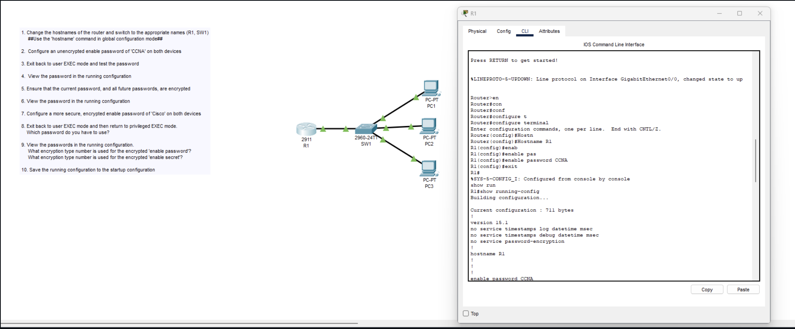
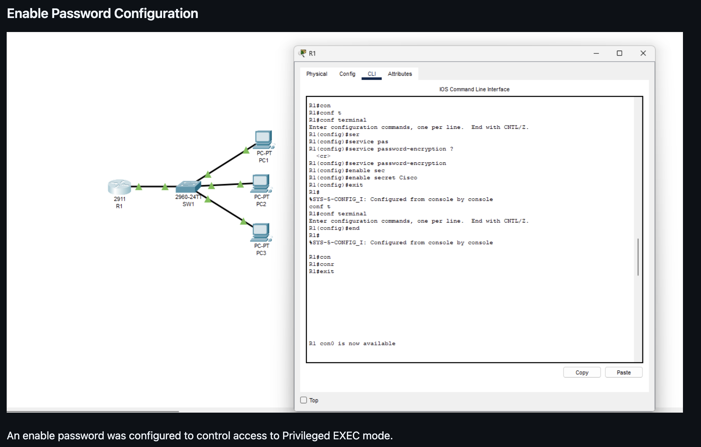
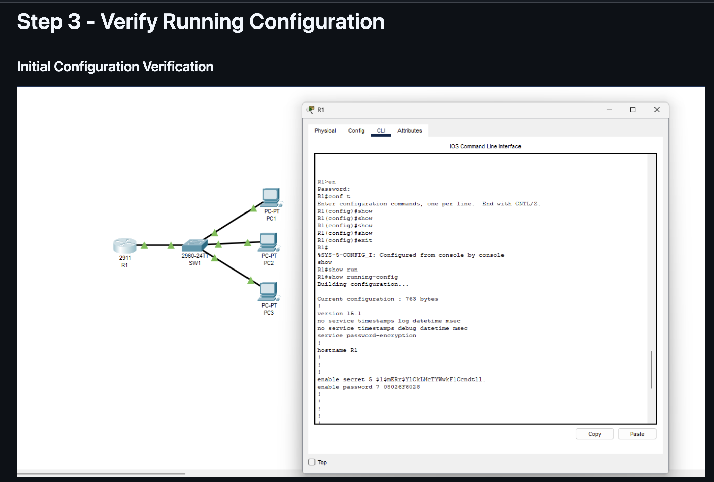
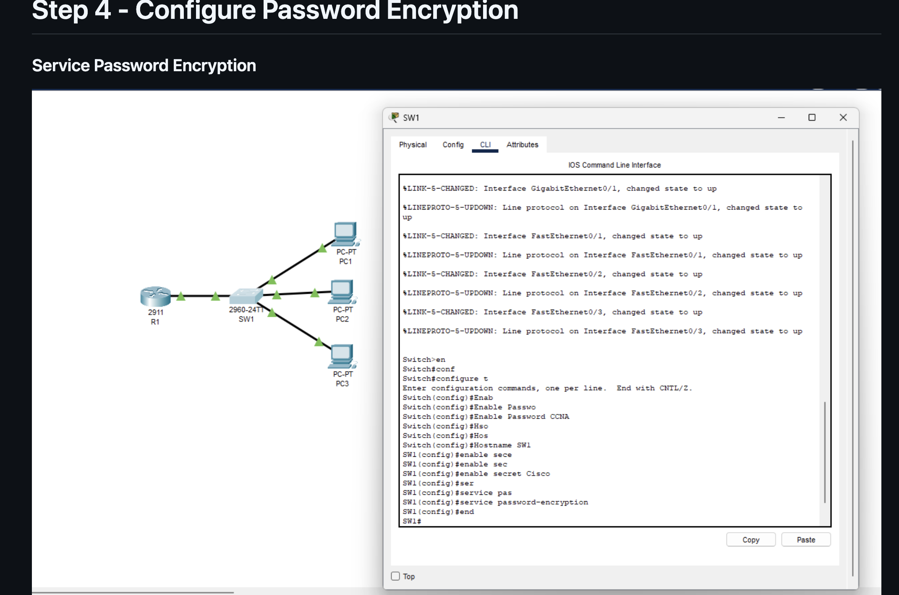
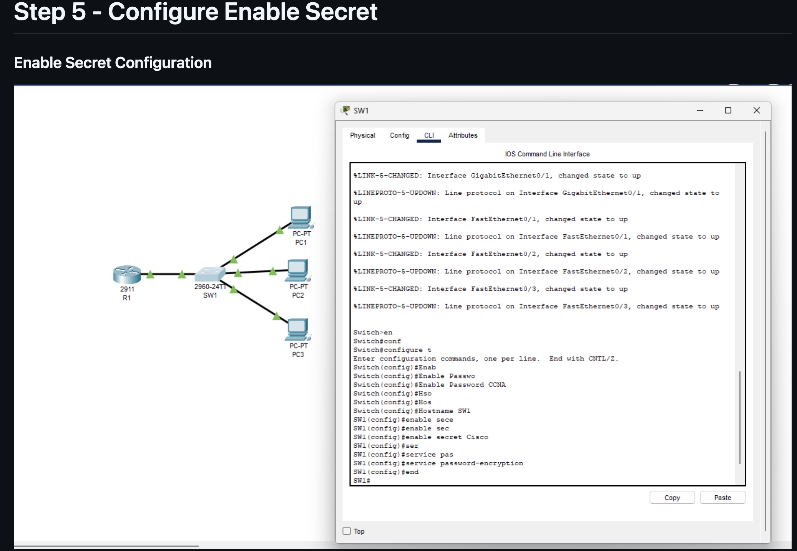
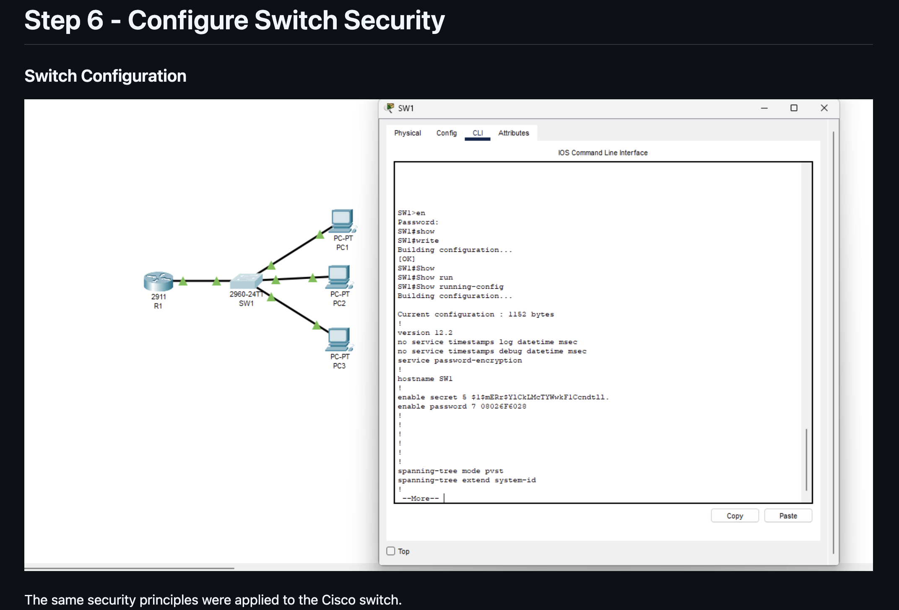

# Day 04 · Basic Device Security

[← Lab portfolio](../README.md)

**Environment:** Cisco Packet Tracer, R1 running IOS 15.1

## Purpose and Scope

This exercise introduced password protection for privileged EXEC mode and the difference between an active configuration and a saved configuration. I inspected how IOS stored an enable password, added an enable secret, returned to privileged mode, and saved the result.

The lab tasks apply to R1 and SW1. The evidence supplied here documents R1; SW1's security configuration is not shown.

## Topology and Equipment


| Device | Model shown | Role |
| --- | --- | --- |
| R1 | Cisco 2911 | Router used for the captured CLI work |
| SW1 | Cisco 2960-24TT | Switch connecting the router and PCs |
| PC1, PC2, PC3 | PC-PT | Endpoints attached to SW1 |

The exercise focuses on device administration. The supplied router configuration has no interface IP addresses, and no traffic tests are included.

## 1. Establish Device Names and Initial Access

The exercise begins by assigning the names R1 and SW1 and setting an initial enable password. The following is a reproduction sequence for R1, not a transcript of my initial setup:

```text
enable
configure terminal
hostname R1
enable password CCNA
end
show running-config
```

My supplied output confirms `hostname R1` and the later encrypted password entry. It begins after the original hostname and initial-password commands. Before enabling password encryption, the exercise expects the password to be readable in the configuration.

## 2. Change How the Password Is Stored

I enabled password encryption and inspected the running configuration from configuration mode:

```text
R1(config)#service password-encryption
R1(config)#do sh run
```

Relevant output from my session:

```text
service password-encryption
hostname R1
enable password 7 08026F6028
```

The `7` identifies the stored password format. The lab asks for an initial enable password of `CCNA`; the supplied transcript begins after that initial setup, so it does not show the original password command.

On this lab image, `service password-encryption` changes eligible cleartext password entries to Type 7. Type 7 is reversible obfuscation, not strong protection. The command also does not encrypt network traffic. [Cisco: Protecting Secrets](https://www.cisco.com/c/en/us/about/trust-center/resilient-infrastructure/protecting-secrets.html)

## 3. Set a Secret and Test Privileged Access

After correcting a spelling error, I entered:

```text
R1(config)#enable secret Cisco
R1(config)#exit
R1#exit
```

I returned to the console and entered privileged EXEC mode:

```text
R1>enable
Password:
Password:
R1#sh run
```

The transcript shows two password prompts followed by `R1#`, confirming that privileged access was eventually obtained. The typed responses are hidden, so the transcript does not establish which value was entered at each prompt.

The running configuration then included both entries:

```text
enable secret 5 $1$mERr$YlCkLMcTYWwkF1Ccndtll.
enable password 7 08026F6028
```

| Question from the exercise | Answer |
| --- | --- |
| Which credential takes precedence? | The enable secret. For this configuration, the lab secret is `Cisco`. |
| What format is the enable password using? | Type 7. |
| What format is the enable secret using? | Type 5 on this IOS image. |
| Does adding a secret remove the password entry? | No; both entries remain visible in this configuration. |

An enable secret takes precedence over an enable password. Type 5 stores an MD5-based hash rather than reversible Type 7 text; it is a legacy format, not a modern password-storage target. These results describe this Packet Tracer image. [Cisco password controls](https://www.cisco.com/c/en/us/td/docs/routers/secure-routers/sec-8100-series/software-config-guide/cisco-8100-series-secure-routers-software-configuration-guide/sec_router_access_pwd_privilege.html), [Cisco credential formats](https://www.cisco.com/c/en/us/about/trust-center/resilient-infrastructure/protecting-secrets.html)

## 4. Resolve Command Errors

| Attempt | Why IOS rejected it | Working command |
| --- | --- | --- |
| `R1(config)#sh run` | The EXEC command was entered directly in global configuration mode. | `do sh run` |
| `R1(config)#enable sercet Cisco` | `secret` was misspelled. | `enable secret Cisco` |

The first error taught me to check the prompt before entering a command. `R1(config)#` and `R1#` represent different modes. The `do` prefix lets me run an EXEC command while staying in configuration mode.

The second was a syntax mistake. Reading the command again and correcting the keyword resolved it.

## 5. Save R1 and Read Back the Saved Settings

I practiced three ways to save the running configuration:

```text
R1#write
Building configuration...
[OK]

R1#write memory
Building configuration...
[OK]

R1#copy running-config startup-config
Destination filename [startup-config]?
Building configuration...
[OK]
```

These are alternative save commands; running all three is not required. I used them here to practice the available forms.

I then checked the saved configuration:

```text
R1#show startup-config
Using 767 bytes
!
version 15.1
service password-encryption
hostname R1
enable secret 5 $1$mERr$YlCkLMcTYWwkF1Ccndtll.
enable password 7 08026F6028
```

This is an excerpt of the supplied output; unrelated lines are omitted. The saved configuration contains the hostname, password-encryption setting, and both credential entries. That verifies the save operation. A reload test was not recorded.

## 6. Apply the Procedure to SW1

The same administrative settings are part of the switch exercise. This is the command sequence to reproduce on SW1:

```text
enable
configure terminal
hostname SW1
enable password CCNA
service password-encryption
enable secret Cisco
end
```

To test privileged access, use `disable` to return to `SW1>`, then enter `enable` and provide the secret. Save and inspect the settings with:

```text
copy running-config startup-config
show startup-config
```

The reference examples below illustrate the switch procedure. My own SW1 command output has not been supplied, so switch verification remains pending.

## Results from My Session

| Check | Result supported by the session |
| --- | --- |
| Router hostname | `hostname R1` appears in running and startup output. |
| Password representation | Type 7 enable password is visible. |
| Secret representation | Type 5 enable secret is visible. |
| Privileged access | Session returns from `R1>` to `R1#` after password prompts. |
| Persistence | Save commands return `[OK]`; `show startup-config` contains the settings. |
| Switch configuration | SW1 is present in the topology; its CLI verification has not been supplied. |

## Lessons from the Exercise

I learned to use the CLI prompt as a guide to command context, distinguish a password entry from a secret, and verify a save by reading startup configuration. The most useful habit from this exercise is checking the result of a command rather than treating successful entry as the end of the task.

## Saved Material

- [01-r1-password-configuration.png](../Photos/Day-04/01-r1-password-configuration.png) — original topology and R1 screenshot.
- The command excerpts above preserve the relevant results from my pasted CLI session.
- `Labs/day-04-basic-device-security.pkt` can be added when the completed saved file is supplied.

## Reference Walkthrough Images

The following images were supplied as examples from [TushanDorsey's Day 4 writeup](https://github.com/TushanDorsey/Network-Engineering-Labs-CCNA-2026/blob/main/Labs/Day-04-Basic-Device-Security.md). They illustrate the workflow and belong to that reference, not to my lab evidence. The explanations above are written around my own supplied R1 session. Some reference headings cover overlapping steps, so the images are grouped below by what they show.

### Initial router naming and cleartext password



**Reference image — TushanDorsey.** The example shows hostname and initial enable-password entry.

### Router password protection



**Reference image — TushanDorsey.** The example shows password-encryption and enable-secret commands.

### Router configuration inspection



**Reference image — TushanDorsey.** The example displays both stored password formats.

### Switch setup sequence



**Reference image — TushanDorsey.** The example applies hostname and credential settings to SW1.

### Switch secret and password storage



**Reference image — TushanDorsey.** This overlaps the preceding switch example and is retained as a supplied reference.

### Switch save and inspection



**Reference image — TushanDorsey.** The example shows a successful save and running-configuration output on the reference switch.
