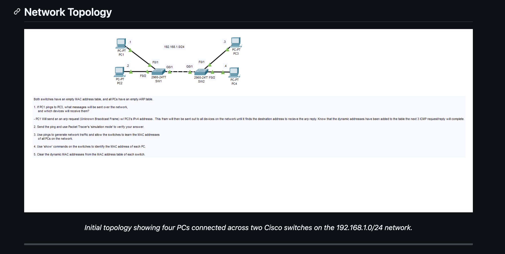
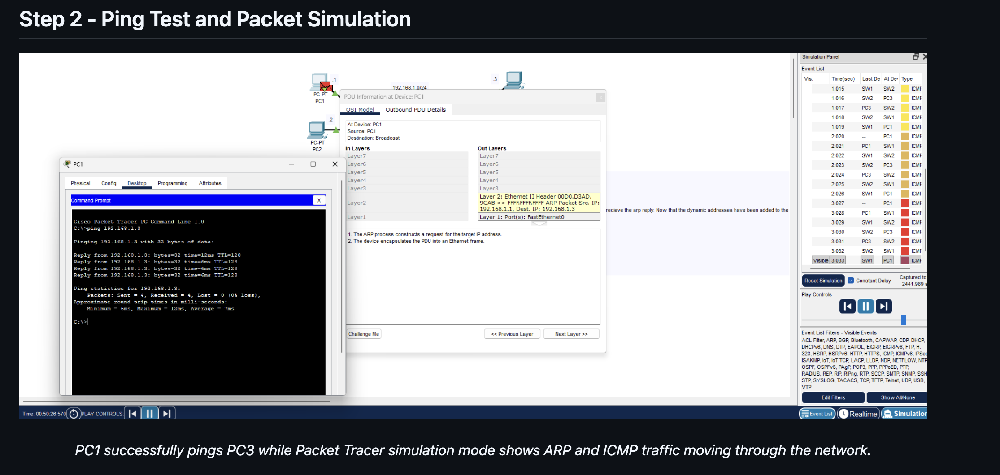
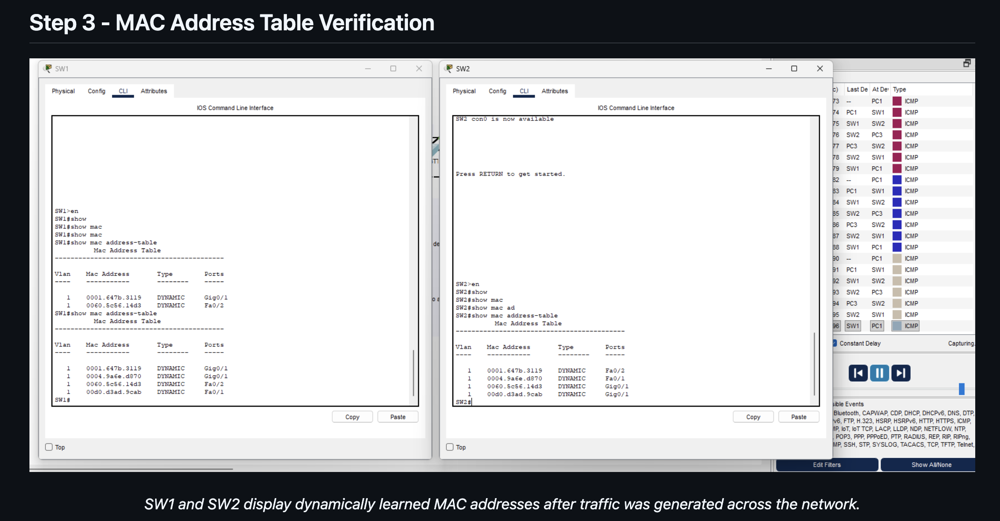
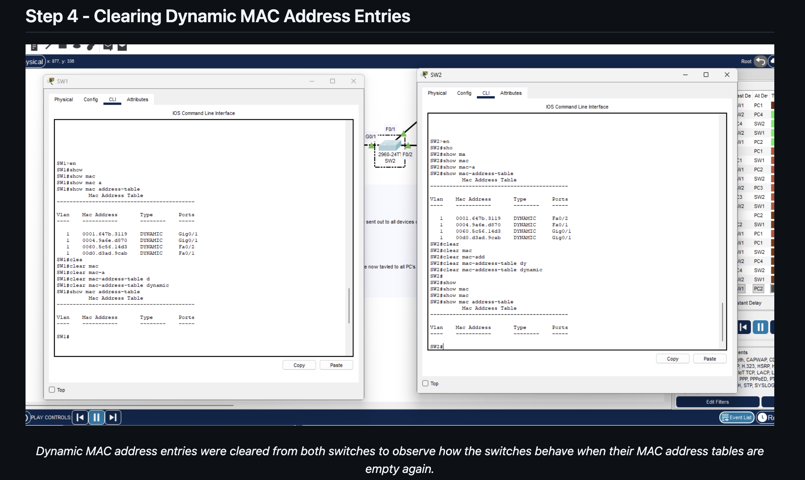

# Day 06 · Tracing Frames Across Two Switches

[← Lab portfolio](../README.md)

**Focus:** ARP, ICMP, and dynamic MAC learning in Cisco Packet Tracer

## Experiment and Results

I used a four-PC network to examine how traffic reaches a host on another switch. The saved results show a successful PC1-to-PC3 ping, four learned endpoint addresses on each switch, and empty dynamic tables after clearing them.

| Check | Captured result |
| --- | --- |
| PC1 ping to 192.168.1.3 | Four replies; 0% packet loss |
| Learned addresses | Four dynamic entries in VLAN 1 on each switch |
| Clearing entries | Both switches display empty tables immediately after the clear command |

## Network Layout



The switches are Cisco 2960-24TT devices. Their GigabitEthernet0/1 ports connect to each other. All four hosts belong to the labeled `192.168.1.0/24` subnet.

| Host | Address label | Access port |
| --- | --- | --- |
| PC1 | 192.168.1.1 | SW1 Fa0/1 |
| PC2 | 192.168.1.2 | SW1 Fa0/2 |
| PC3 | 192.168.1.3 | SW2 Fa0/1 |
| PC4 | 192.168.1.4 | SW2 Fa0/2 |

The exercise specifies empty host ARP caches and switch MAC tables at the start. That is the stated starting condition; the first image does not display those tables directly.

[View the exercise setup capture](../Photos/Day-06/02-lab-starting-conditions.png)

## Following the First Exchange

From PC1, I ran:

```text
ping 192.168.1.3
```



The command output shows four packets sent and four received. The displayed round-trip times range from 6 to 12 ms, with a 7 ms average. The open PDU window shows an ARP request with sender IP `192.168.1.1`, target IP `192.168.1.3`, and Ethernet destination `FFFF.FFFF.FFFF`.

With no cached mapping for PC3, the expected sequence is:

1. PC1 broadcasts an ARP request asking which host owns 192.168.1.3.
2. SW1 learns PC1's source MAC on Fa0/1 and sends the broadcast through the other forwarding ports in the same VLAN, including the link to SW2.
3. SW2 learns PC1's address on its inter-switch port and distributes the request to its local hosts. PC2, PC3, and PC4 receive the request; PC3 is the requested host.
4. PC3 replies to PC1. The switches learn PC3's source address as the reply travels back.
5. PC1 can address Ethernet frames to PC3 while exchanging ICMP Echo Requests and Replies.

An ARP request is a **broadcast**, not an unknown unicast. Both may be flooded within a VLAN, but for different reasons: broadcast delivery is intentional, while unknown-unicast flooding occurs when a switch has no matching destination entry. The captured ping has no loss; a first-ping timeout is not required for ARP resolution.

## Reading the Learned Paths

After generating traffic, I inspected both switches:

```text
show mac address-table
```



The final displayed tables contain the same four MAC addresses, but their ports differ. Mapping the access ports to the topology gives:

| Host inferred from access port | MAC address | SW1 port | SW2 port |
| --- | --- | --- | --- |
| PC1 | 00d0.d3ad.9cab | Fa0/1 | Gi0/1 |
| PC2 | 0060.5c56.14d3 | Fa0/2 | Gi0/1 |
| PC3 | 0004.9a6e.d870 | Gi0/1 | Fa0/1 |
| PC4 | 0001.647b.3119 | Gi0/1 | Fa0/2 |

All four entries are marked `DYNAMIC` in VLAN 1. Each switch reaches its local PCs through separate access ports and the remote PCs through Gi0/1. Multiple addresses on Gi0/1 therefore make sense: the port leads to another switch with multiple hosts behind it.

PC1's MAC also matches the source address in the ARP capture. The other host assignments are inferred from the shown topology and access-port mappings.

## Clearing the Tables



The device windows show this clear-command form:

```text
SW1#clear mac-address-table dynamic
SW1#show mac address-table

SW2#clear mac-address-table dynamic
SW2#show mac address-table
```

The resulting displays contain the column headings without learned entries. This verifies that the dynamic entries were cleared at capture time.

Clearing a switch table does not clear a PC's ARP cache. If the PCs still know each other's MAC addresses, their next traffic may be unicast immediately, while the switches initially flood unknown destinations and relearn source addresses. The screenshots do not include a separate post-clear relearning test.

## Command Notes

| Command | Purpose |
| --- | --- |
| `ping 192.168.1.3` | Test IP reachability from PC1 to PC3 |
| `show mac address-table` | Inspect learned MAC addresses, VLANs, and ports |
| `clear mac-address-table dynamic` | Remove dynamically learned entries; spelling shown in the device capture |

The supplied command-summary image uses `clear mac address-table dynamic` instead. Command syntax can differ between IOS images; the walkthrough above preserves the spelling visible in this session. Use CLI `?` help if a form is rejected.

[View the supplied command summary](../Photos/Day-06/06-command-summary.png)

## What This Lab Taught Me

The two tables describe paths through the LAN, not just lists of connected hardware. Comparing them made it clear why the same endpoint appears on an access port at one switch and the uplink at the other.

I also separated two kinds of stored information: hosts use ARP to map IPv4 addresses to MAC addresses, while switches learn source MAC addresses and the ports they arrive on. Checking both explains more than a successful ping alone.

## Evidence and Scope

The six supplied images are stored in `Photos/Day-06`, in topology-to-verification order. Their embedded headings and captions are preserved as supplied; the report above is independently written around the visible results. The topology and initial-conditions images overlap, so the second is linked rather than repeated at full size.


